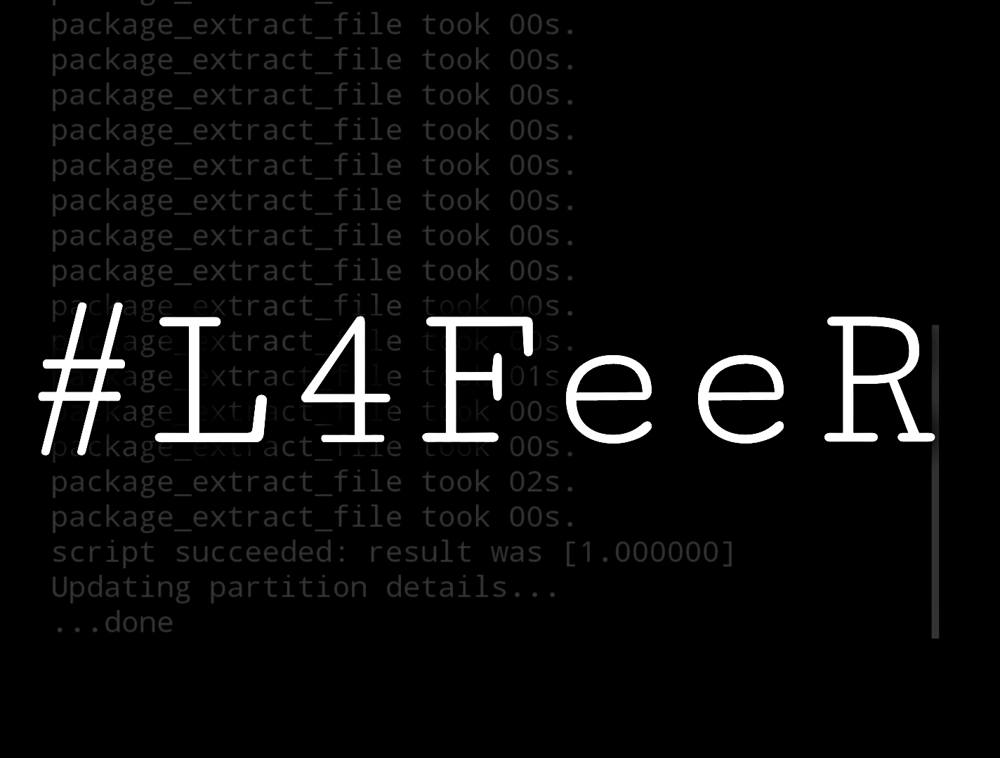

# ***⠀⠀⠀⠀⠀⠀⠀Welcome To My Coding Space***

# ***⠀⠀ ⠀⠀⠀⠀⠀⠀#L4FeeR***

***Here Is The Menu Of This Entire-Post.***

* * *

***⠀⠀⠀⠀⠀⠀⠀⠀⠀My-Self***

  # `Muhamed L4FeeR`,
** just a normal guy ,who like Software and Programming Side.***

**Like To Be A Kramel Dev :p**

* * *

**⠀⠀⠀⠀⠀⠀⠀⠀⠀⠀Links**

**----->**  [Telegram](https://t.me/kali_nethunter_android)

**----->**  [Youtube](https://youtube.com/channel/UCOB6x1Bn0dpBk0ZOHcARKYQ)

**----->**  [Github](https://github.com/L4FeeR)

 * * * 

**⠀⠀⠀⠀⠀⠀⠀⠀My⠀Kernel Builds.**

**Device      : Redmi Note 6 Pro**

**Codename : tulip**

**Android    : 9p,10q,11r,12s**

—————————————————————————————————————————————————
# **Newcam**

# [L4FeeR-NetHunTeR-NewCam-V6.8c](assests/kernel/L4FeeR-NetHunTeR-NewCam-V6.8c.zip)

# **Oldcam**

# [L4FeeR-NetHunTeR-OldCam-V6.8c](assests/kernel/L4FeeR-NetHunTeR-OldCam-V6.8c)
————————————————————————————————————————————————

* * *

